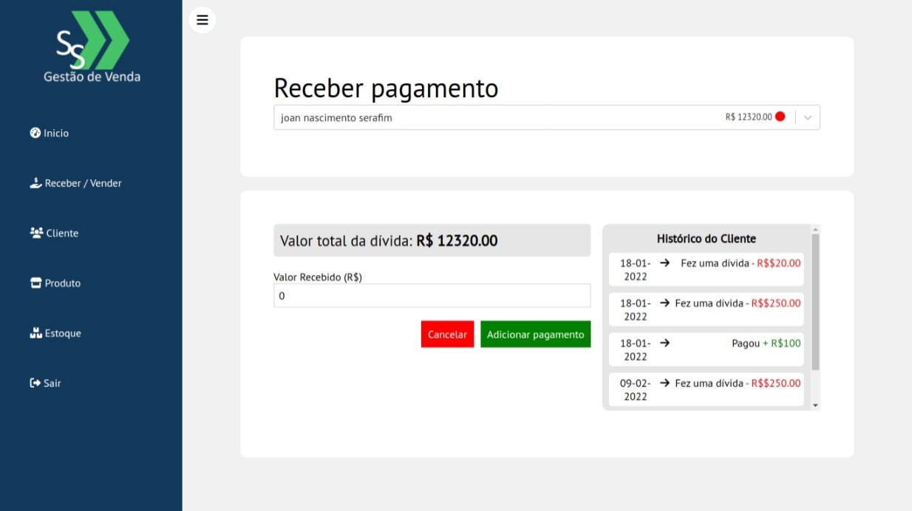
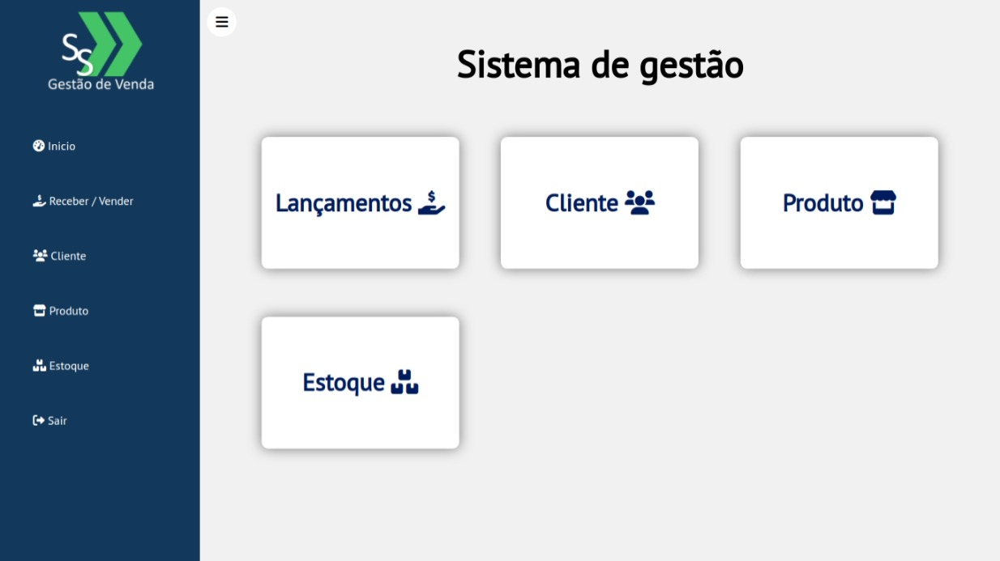
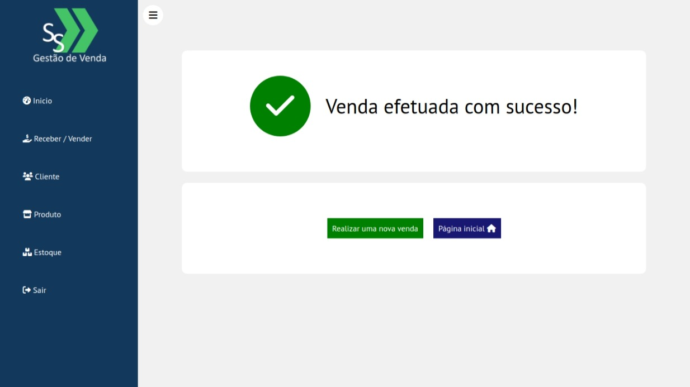

<a href="https://sistema-gestao-frontend-xi.vercel.app/login">
    <p align="center">
        
    </p>
</a>
    
------------------------------------
## Índice

* [Preview](#preview)
* [Sobre](#sobre)
* [Funcionalidades](#funcionalidades)
* [Layout](#layout)
* [Como Executar](#como-executar)
* [Tecnologias](#tecnologias)
* [Autor](#autor)
* [Licença](#licenca)

------------------------------------

## 💻 Sobre <a id="sobre"></a>
Sistema de gestão para monitar vendas e compras, gastos e ganhos de lojas/empresas/uso pessoal.
<br>

------------------------------------

## 🚀 Preview <a id="preview"></a>

senha: 123
-> https://sistema-gestao-saulo.vercel.app/login

------------------------------------

## ⚙️ Funcionalidades <a id="funcionalidades"></a>
1. ✅ Uso restrito à desktops
2. ✅ Dinâmico
3. ✅ Dashboard para administradores
4. ✅ Análide automatica de gastos/ganhos com base na data
5. ✅ Receber e vender

------------------------------------

## 🎨 Layout <a id="layout"></a>

<a href="https://sistema-gestao-saulo.vercel.app/login"></a>


<p>*O Layout completo do site está disponível (SENHA: 123)<a href="https://sistema-gestao-saulo.vercel.app/login">aqui</a>.</p>







------------------------------------

## 🧩 Como Executar <a id="como-executar"></a>

Para executar o projeto na sua máquina, basta seguir a sequencia de passos:

```
# Execute o servidor e o cliente

$ cd Frontend && yarn install && yarn start

$ cd Backend && yarn install && yarn start

```

------------------------------------

## 🤖 Tecnologias <a id="tecnologias"></a>

Neste sistema de gestão, foram utilizadas as seguintes tecnologias: 

* Bootstrap 
* HTML5  
* CSS3 
* Javascript 
* Nodejs 
* React 
* PostgreSQL 

------------------------------------

## 👨 Autor <a id="autor"></a>

<p align="center">➡️ Desenvolvido por <strong>eu</strong> mesmo 🧑‍💻.</p>

------------------------------------

## 📜 Licença <a id="licenca"></a>

<p align="center">Todos os direitos reservados ©Copyright - Saulo Felipe</p>
